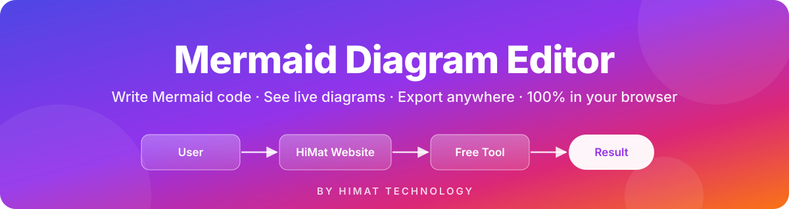
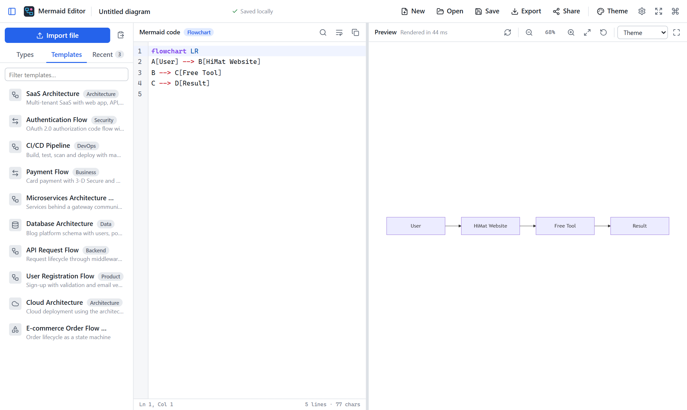
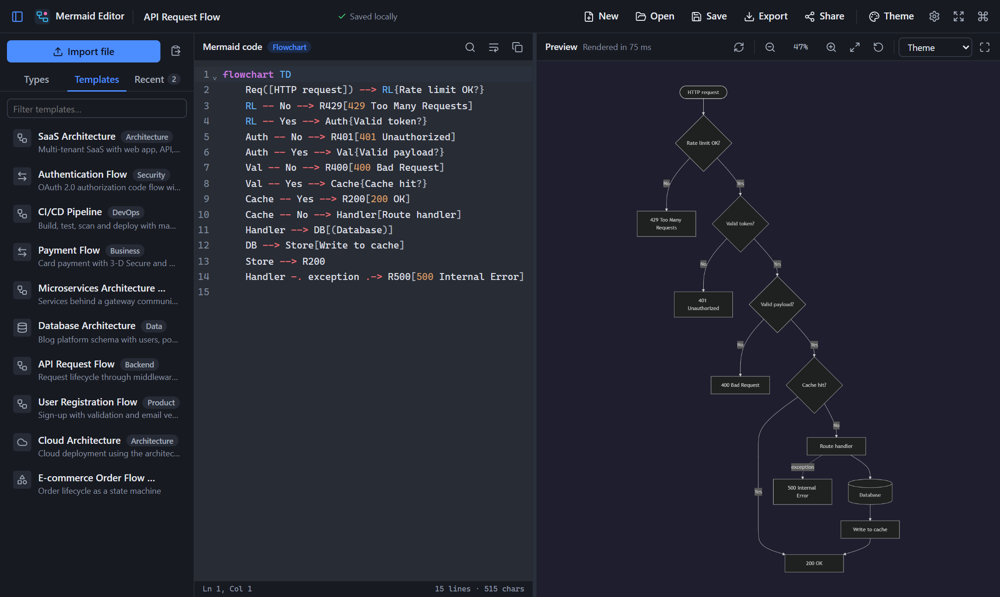
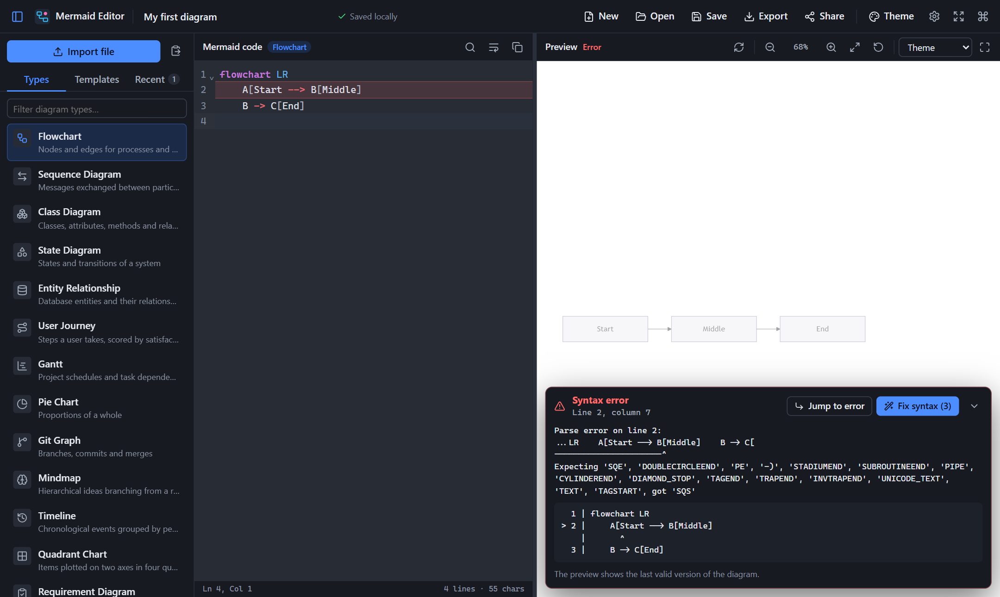
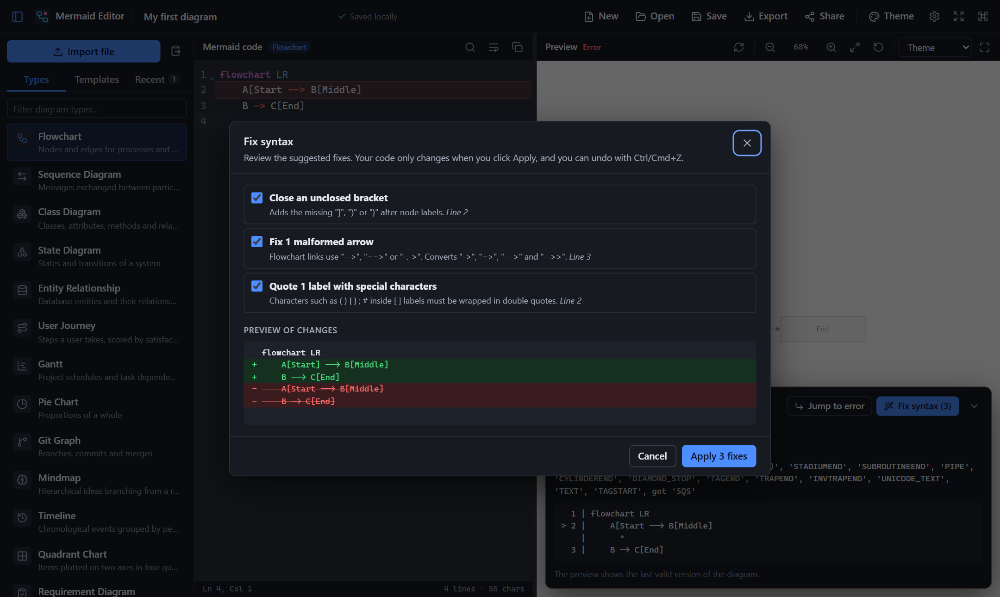
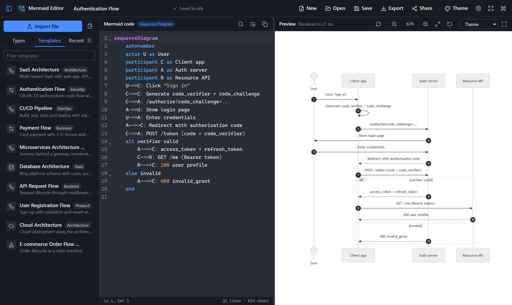
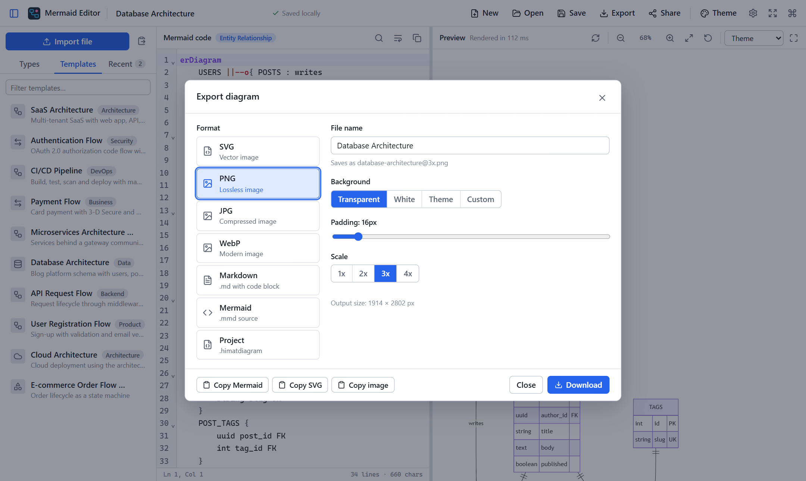
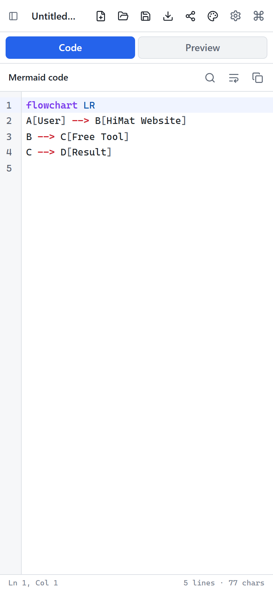
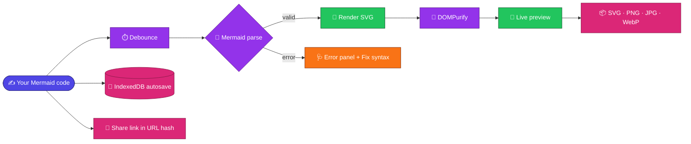

<div align="center">

<a href="https://himat.tech/free-tools/mermaid-diagram-editor">
  
</a>

<br />

<a href="https://himat.tech/free-tools/mermaid-diagram-editor">
  
</a>
<a href="https://himat.co.in">
  
</a>

<br /><br />


<h3>✨ Write Mermaid code · 👀 See it live · 📦 Export anywhere · 🔒 Nothing leaves your browser ✨</h3>

<p>
  <a href="#-features">Features</a> •
  <a href="#-screenshots">Screenshots</a> •
  <a href="#-getting-started">Getting started</a> •
  <a href="#%EF%B8%8F-keyboard-shortcuts">Shortcuts</a> •
  <a href="#-how-it-works">How it works</a> •
  <a href="#-connect-with-himat-technology">Contact</a>
</p>

</div>

---

## 💡 About

**Mermaid Diagram Editor** is a free, local-first, browser-only editor and generator for [Mermaid](https://mermaid.js.org/) diagrams, built by **[HIMAT Technology](https://himat.co.in)**. Write Mermaid code in a real code editor and get a live preview with pan and zoom. Start from **23 diagram types** or **10 real-world templates**, then export to SVG, PNG, JPG, WebP, Markdown, `.mmd` or `.himatdiagram` project files.

> [!TIP]
> 🚀 **Try it online:** **[himat.tech/free-tools/mermaid-diagram-editor](https://himat.tech/free-tools/mermaid-diagram-editor)**. No sign-up, no install.

Everything runs in your browser. There is no backend, no account and no telemetry. Diagrams are stored in IndexedDB, and share links carry the diagram inside the URL fragment, so the data never reaches a server.

<table>
  <tr>
    <td align="center" width="25%">🔒<br /><b>100% private</b><br /><sub>No server, no login, no tracking</sub></td>
    <td align="center" width="25%">⚡<br /><b>Live preview</b><br /><sub>Debounced rendering with pan and zoom</sub></td>
    <td align="center" width="25%">🧩<br /><b>33 templates</b><br /><sub>23 diagram types plus 10 real-world flows</sub></td>
    <td align="center" width="25%">📦<br /><b>7 export formats</b><br /><sub>SVG · PNG · JPG · WebP · MD · MMD · project</sub></td>
  </tr>
</table>

## 🎨 Features

| | Feature | What you get |
| :-: | --- | --- |
| ✍️ | **Code editor (CodeMirror 6)** | Mermaid syntax highlighting, line numbers, code folding, search and replace (`Ctrl/Cmd+F`), keyword autocomplete, auto-indentation, bracket matching, multiple cursors, undo/redo, word wrap, and light/dark editor themes. |
| 👀 | **Live preview** | Debounced rendering (configurable delay) and manual render (`Ctrl/Cmd+Enter`). Pan with drag or arrow keys, zoom with the wheel, pinch, buttons or `+`/`-`, fit to screen, reset, and fullscreen. The background can be the theme's, white, transparent or a custom color. |
| 🩺 | **Error handling** | Invalid code never crashes the app, and the last valid diagram stays visible. The error panel shows the message, line, column and a source excerpt. **Jump to error** moves the cursor to the problem line. **Fix syntax** shows a diff of safe fixes and only applies them when you confirm. |
| 🧩 | **Templates** | **23 diagram types** with working starters, plus **10 real-world engineering templates**. |
| 📥 | **Import** | `.mmd`, `.mermaid`, `.md`/`.markdown` (with a picker for files with several Mermaid blocks), `.himatdiagram`, and exported `.svg` files with metadata. Import by drag and drop, the paste dialog, pasting outside the editor, or `Ctrl/Cmd+O`. |
| 💾 | **Autosave library** | Every diagram is saved to IndexedDB. The Recent list can be searched and sorted, and supports open, rename, duplicate, delete and download. |
| 📦 | **Export** | SVG (background, padding, optional metadata), PNG at 1x–4x, JPG and WebP with adjustable quality, Markdown, `.mmd` and `.himatdiagram`. |
| 📋 | **Clipboard** | Copy the Mermaid source, the SVG or the rendered PNG. If a browser lacks clipboard support, the app falls back gracefully and tells you. |
| 🔗 | **Share links** | Diagrams are compressed into `#d=…` with lz-string. Opening the link restores the code, theme and settings, with no server involved. |
| 🌈 | **Themes** | Default, Neutral, Dark, Forest and Base, plus Mermaid 12's Neo and Neo Dark, with a light or dark interface. |
| ⚙️ | **Settings** | Theme, look (classic / hand-drawn / neo), layout engine (Dagre / ELK), flowchart direction and curve, font size, padding, security level, preview background, SVG metadata, preview scale, render delay and auto-render. |
| 🎯 | **Command palette** | `Ctrl/Cmd+K` gives access to every command, theme, diagram type and template. |
| ♿ | **Accessibility** | Keyboard-operable menus, tabs, dialogs and canvas; focus trapping; ARIA labels; visible focus rings; shortcut tooltips; `prefers-reduced-motion` support. |
| 📱 | **Responsive** | Three columns on desktop, a drawer sidebar on tablets, and Code/Preview tabs on phones. |

## 📸 Screenshots

<table>
  <tr>
    <td width="50%"><p align="center"><b>☀️ Light mode</b> · Microservices template, Forest theme</p></td>
    <td width="50%"><p align="center"><b>🌙 Dark mode</b> · API Request Flow, Dark theme</p></td>
  </tr>
  <tr>
    <td width="50%"><p align="center"><b>🩺 Error panel</b> · line, column and excerpt</p></td>
    <td width="50%"><p align="center"><b>🪄 Fix syntax</b> · review the diff before applying</p></td>
  </tr>
  <tr>
    <td width="50%"><p align="center"><b>🔐 Sequence diagrams</b> · OAuth 2.0 + PKCE template</p></td>
    <td width="50%"><p align="center"><b>📦 Export</b> · PNG at 3x, backgrounds, padding</p></td>
  </tr>
</table>

<p align="center">
  <br />
  <b>📱 Works on phones too</b>
</p>

## 🛠️ Tech stack

| Area | Choice |
| --- | --- |
| ⚛️ UI | React 19, TypeScript 6 |
| ⚡ Build | Vite 8 |
| 🧜 Diagrams | Mermaid 12 (lazy-loaded) |
| ✍️ Editor | CodeMirror 6 with a custom Mermaid stream language |
| 💾 Storage | IndexedDB via [`idb`](https://github.com/jakearchibald/idb), with localStorage for preferences |
| 🔗 Sharing | [`lz-string`](https://github.com/pieroxy/lz-string) |
| 🧼 Sanitizing | [DOMPurify](https://github.com/cure53/DOMPurify) |
| 🎨 Icons | lucide-react |
| 💅 Styling | Plain CSS with custom properties (no CSS framework) |
| 🧪 Tests | Vitest, jsdom, fake-indexeddb |

## 🚀 Getting started

Requires **Node.js 20.19+** (or 22.12+) and npm.

```bash
npm install
npm run dev
```

Open <http://localhost:5173> and start drawing. 🎉

### 🏗️ Production build

```bash
npm run build
npm run preview
```

`npm run build` type-checks (`tsc -b`) and writes a static site to `dist/`. The build uses a relative base (`./`), so you can host `dist/` from any static host or sub-path. `npm run preview` serves it at <http://localhost:4173>.

### 📜 Other scripts

| Script | Purpose |
| --- | --- |
| `npm test` | Run the unit tests once |
| `npm run test:watch` | Run tests in watch mode |
| `npm run typecheck` | TypeScript project check |

## ⌨️ Keyboard shortcuts

| Shortcut | Action |
| --- | --- |
| <kbd>Ctrl/Cmd</kbd> + <kbd>S</kbd> | 💾 Save |
| <kbd>Ctrl/Cmd</kbd> + <kbd>O</kbd> | 📂 Open / import a file |
| <kbd>Ctrl/Cmd</kbd> + <kbd>Enter</kbd> | ▶️ Render now |
| <kbd>Ctrl/Cmd</kbd> + <kbd>Shift</kbd> + <kbd>S</kbd> | 📦 Export dialog |
| <kbd>Ctrl/Cmd</kbd> + <kbd>K</kbd> | 🎯 Command palette |
| <kbd>Ctrl/Cmd</kbd> + <kbd>B</kbd> | 📑 Toggle sidebar |
| <kbd>Alt</kbd> + <kbd>N</kbd> | ✨ New diagram (`Ctrl+N` is reserved by browsers) |
| <kbd>Ctrl/Cmd</kbd> + <kbd>F</kbd> | 🔍 Search and replace in the editor |
| <kbd>Esc</kbd> | ❌ Close dialogs, menus, drawer or fullscreen |
| Preview canvas: arrows, <kbd>+</kbd>, <kbd>-</kbd>, <kbd>0</kbd>, <kbd>F</kbd> | 🧭 Pan, zoom in, zoom out, reset, fit |

Global shortcuts are registered in the capture phase and always need a modifier key, so they never interfere with typing. They take precedence over editor bindings that would otherwise swallow them (CodeMirror maps `Mod+Enter` to "insert blank line").

## 🧠 How it works



### 🧜 Mermaid rendering

`services/mermaidService.ts` lazy-loads Mermaid with `import('mermaid')`, so the editor shell paints before the large Mermaid bundle arrives. Each render:

1. Calls `mermaid.initialize()` with a config built from the diagram's theme and settings (`buildMermaidConfig`). The config uses `startOnLoad: false`, `suppressErrorRendering: true`, a size limit, and the chosen `securityLevel`.
2. Runs `mermaid.parse()` first to get a structured syntax error, then `mermaid.render()`.
3. Sanitizes the SVG with DOMPurify (SVG and HTML profiles for `<foreignObject>` labels; scripts, iframes and event handlers removed) and serializes it back to well-formed XML.
4. Removes any temporary DOM nodes Mermaid created.

Mermaid keeps global state, so renders are serialized through a promise queue. `hooks/useMermaid.ts` debounces code changes (400 ms by default) and renders immediately when the theme, settings or open diagram change. It discards results from outdated requests and keeps the last successful SVG while there are errors. The preview inserts the SVG by parsing it as XML and importing the nodes, not with `innerHTML`/`dangerouslySetInnerHTML`. Pan and zoom only change a CSS transform, so the SVG DOM is never rebuilt while navigating.

Errors are normalized by `utils/errorParser.ts`. It reads jison `hash.loc` data, Langium-style "line X, column Y" messages, and unknown-diagram errors, and produces a message, line, column and excerpt. `utils/syntaxFixer.ts` offers reviewable fixes for common mistakes:

- unclosed brackets
- malformed flowchart arrows (`->`, `=>`, `- ->`, `-->>`)
- sequence arrows
- labels with special characters that need quotes
- a missing diagram declaration
- wrong keyword casing and typos
- curly quotes
- missing subgraph `end`
- stray Markdown fences

### 💾 IndexedDB autosave

`services/storageService.ts` opens the `mermaid-diagram-editor` database. Its `diagrams` object store is keyed by `id` and has an `updatedAt` index, used for "most recent first" listing. Each record stores `id`, `name`, `code`, `type`, `theme`, `config`, `createdAt` and `updatedAt`.

`hooks/useAutosave.ts` watches the current diagram and saves 800 ms after the last change. It flushes immediately on `Ctrl/Cmd+S`, before switching diagrams, and when the page is hidden or closed. The toolbar shows *Unsaved changes → Saving… → Saved locally*. The last opened diagram id and UI preferences live in localStorage. If IndexedDB is unavailable (for example, some private modes), the editor still works in memory and shows a notice.

### 🔗 Share URLs

`services/shareService.ts` serializes `{ v, n: name, c: code, t: theme, o: non-default settings }` to JSON and compresses it with `lz-string`'s URL-safe encoding. The result goes into the fragment: `https://host/path#d=<data>`. Browsers never send the fragment to the server. When the app loads, or the hash changes, the fragment is decoded and validated (unknown themes fall back to Default, and unsafe security levels are rejected). The diagram opens as a new entry in your library, and the fragment is removed from the address bar so a refresh doesn't import it again. The share dialog warns when a link gets longer than 8,000 characters.

### 📦 Exports

- **SVG:** `utils/svgUtils.prepareSvgForExport` gives the SVG an explicit pixel size, adds padding to the `viewBox`, and optionally inserts a background `<rect>`. It can also embed `<title>`, `<desc>`, and `<metadata><mermaid:source><![CDATA[…]]></mermaid:source></metadata>`. SVGs exported with metadata can be imported back into the editor.
- **PNG/JPG/WebP:** `utils/imageExport.rasterizeSvg` loads the prepared SVG as a data-URL image and draws it on a canvas at 1x–4x. JPG always gets a background. The scale is reduced automatically if the canvas would exceed browser size limits, and the app tells you when that happens. If a browser taints the canvas because of `<foreignObject>` labels, the export re-renders the diagram with pure-SVG text labels and tries again.
- **Markdown / .mmd / .himatdiagram:** generated as text and downloaded with a Blob and object URL.

The `.himatdiagram` format is JSON:

```json
{
  "format": "himatdiagram",
  "version": 1,
  "name": "My Diagram",
  "code": "flowchart LR\n  A --> B",
  "type": "flowchart",
  "theme": "default",
  "look": "classic",
  "config": { "layout": "dagre", "curve": "basis", "fontSize": 16, "diagramPadding": 8, "securityLevel": "strict", "background": "theme" },
  "createdAt": 1790000000000,
  "updatedAt": 1790000000000
}
```

Only `code` is required on import. Every other field is validated and falls back to a default.

## 🧩 Supported diagram types

<p>


</p>

**🏗️ Real-world templates:** SaaS Architecture, Authentication Flow (OAuth 2.0 + PKCE), CI/CD Pipeline, Payment Flow (3-D Secure), Microservices Architecture, Database Architecture, API Request Flow, User Registration Flow, Cloud Architecture and E-commerce Order Flow.

Choosing a **diagram type** loads its starter into the current editor (undo with `Ctrl/Cmd+Z`). Choosing a **template** opens it as a new diagram. A unit test parses every starter and template with Mermaid.

## 🔐 Security

- 🛡️ The default `securityLevel` is `strict`, and only `strict` and `antiscript` are offered. `loose` (click callbacks that run JavaScript) and `sandbox` are not exposed, and share links and project files can't enable them.
- 🧼 All Mermaid output is sanitized with DOMPurify before it is displayed, copied or exported.
- 🚫 The app never calls `eval`, never executes user-provided JavaScript, and has no `dangerouslySetInnerHTML`.
- 🏠 There are no network requests for diagram data. Rendering, storage, export and sharing all happen locally.

## 🧪 Testing

```bash
npm test
```

The unit tests (Vitest) cover:

- ✅ Mermaid code validation, both structural checks and Mermaid's own parser, including every starter and template
- ✅ Markdown Mermaid block extraction
- ✅ `.mmd`/`.mermaid`/Markdown/paste import
- ✅ `.himatdiagram` serialization and deserialization, including sanitizing untrusted input
- ✅ share URL encoding and decoding
- ✅ export file name generation
- ✅ SVG export preparation and metadata round-trip
- ✅ error parsing and excerpts
- ✅ syntax fixes
- ✅ the IndexedDB storage layer (via `fake-indexeddb`)
- ✅ SVG sanitization

The UI was also checked end to end in Chrome: rendering of all templates, errors and fixes, autosave and reload, recent-diagram actions, every export format (including file signatures and PNG scale), all import paths, clipboard, share links, pan and zoom, fullscreen, settings, the command palette, and mobile and tablet layouts.

## 📁 Folder structure

```
├── index.html                  # App shell (applies saved UI theme before first paint)
├── public/favicon.svg
├── docs/                       # README banner and screenshots
├── src/
│   ├── main.tsx                # Entry: StrictMode, error boundary, toast provider
│   ├── App.tsx                 # State orchestration: diagrams, dialogs, shortcuts, commands
│   ├── components/
│   │   ├── CommandPalette/     # Ctrl+K palette with fuzzy search
│   │   ├── Editor/             # CodeMirror wrapper + Mermaid language (highlight, fold, indent, autocomplete)
│   │   ├── Export/             # Export dialog (formats, background, scale, quality, metadata, copy)
│   │   ├── Import/             # Paste dialog, Markdown block picker, drag-and-drop overlay
│   │   ├── Preview/            # Preview panel (pan/zoom/fullscreen), error panel, fix-syntax dialog
│   │   ├── RecentDiagrams/     # Library list: search, sort, rename, duplicate, delete
│   │   ├── Settings/           # Diagram + editor settings
│   │   ├── Share/              # Share-link dialog
│   │   ├── Sidebar/            # Tabs: Types / Templates / Recent
│   │   ├── Templates/          # Diagram type list, template list, icons
│   │   ├── Toolbar/            # Top toolbar
│   │   ├── Workspace/          # Resizable split view / mobile tabs
│   │   └── common/             # Modal, Menu, Toast, IconButton, ConfirmDialog, ErrorBoundary
│   ├── data/                   # diagramTypes.ts (23 starters), templates.ts (10 real-world), themes.ts
│   ├── hooks/                  # useMermaid, useAutosave, useIndexedDB, useKeyboardShortcuts, usePanZoom, usePreferences, useMediaQuery
│   ├── services/               # mermaidService, exportService, importService, storageService, shareService, clipboardService
│   ├── styles/global.css
│   ├── types/                  # diagram.ts, export.ts, settings.ts
│   └── utils/                  # markdownParser, fileUtils, imageExport, errorParser, svgUtils, validation, syntaxFixer, diagramDetection
├── vite.config.ts              # Vite + Vitest config
└── tsconfig*.json
```

## ⚠️ Known limitations

- **Storage is per browser.** IndexedDB data is not synced between browsers or devices. Use `.himatdiagram` exports or share links to move diagrams.
- **Very long share links.** Huge diagrams produce long URLs, which some chat and email apps truncate. Share a project file instead.
- **Clipboard support varies.** Copying images needs the async Clipboard API with `ClipboardItem` (Chromium, Safari, recent Firefox) and a secure context (`https://` or `localhost`). SVG is copied as text, and also as `image/svg+xml` where the browser supports it.
- **Raster export size.** Canvas limits cap output at about 16k px per side. Larger exports are scaled down automatically; use SVG for huge diagrams.
- **Fonts in images.** PNG/JPG/WebP exports use fonts installed on your system. Mermaid's default font stack (Trebuchet MS, Verdana, Arial) renders slightly differently across operating systems.
- **Setting coverage.** Look, layout engine, curve, direction and diagram padding apply only to the diagram types Mermaid supports them for. The settings dialog notes where a setting has no effect.
- **Syntax fixes are heuristics.** They cover common mistakes only, and are always shown as a diff for you to confirm.
- **Beta diagram types.** Some types (Architecture, TreeView, Venn, Radar, Ishikawa, Sankey, XY Chart, Block) are marked beta by Mermaid, and their syntax may change in future Mermaid versions.

## 🤝 Connect with HIMAT Technology

<div align="center">

<p><b>Built with 💜 by <a href="https://himat.co.in">HIMAT Technology</a></b><br />Questions, feedback or a custom project in mind? We'd love to hear from you.</p>

<a href="https://himat.tech/free-tools/mermaid-diagram-editor"></a>
<a href="https://himat.co.in"></a>
<br />
<a href="https://www.facebook.com/people/Himat-technology/61593829197445/"></a>
<a href="https://www.linkedin.com/company/himat-technology"></a>
<a href="https://www.instagram.com/himat_technology?igsi=djdmcGxweWtwYWI0"></a>
<br />
<a href="mailto:info@himat.co.in"></a>
<a href="tel:+919445234023"></a>

<br /><br />

| | Channel | Link |
| :-: | --- | --- |
| 🚀 | Live demo | [himat.tech/free-tools/mermaid-diagram-editor](https://himat.tech/free-tools/mermaid-diagram-editor) |
| 🌐 | Website | [himat.co.in](https://himat.co.in) |
| 📘 | Facebook | [Himat Technology](https://www.facebook.com/people/Himat-technology/61593829197445/) |
| 💼 | LinkedIn | [linkedin.com/company/himat-technology](https://www.linkedin.com/company/himat-technology) |
| 📸 | Instagram | [@himat_technology](https://www.instagram.com/himat_technology?igsi=djdmcGxweWtwYWI0) |
| ✉️ | Email | [info@himat.co.in](mailto:info@himat.co.in) |
| 📞 | Phone | [+91 94452 34023](tel:+919445234023) |

</div>

## 📄 License

MIT, see [LICENSE](LICENSE).

<div align="center">
<br />
<sub>⭐ If this tool saves you time, give the repo a star and share it with your team! ⭐</sub>
</div>
